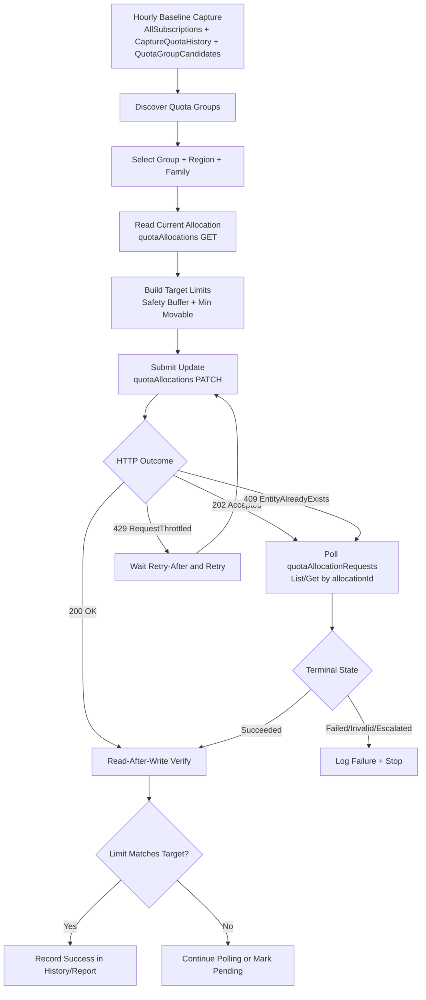

# Quota Group Planning and Movement Flow

## Purpose
This guide captures the quota group workflow implemented and validated in this repo:
- identify unused quota capacity
- generate safe movement candidates
- move quota within a quota group
- return unused subscription quota back to group context
- monitor asynchronous request completion

This document is sanitized for handoff (no tenant-specific IDs, credentials, or user data).

## Scope
- Resource provider: Microsoft.Compute
- API version: 2025-09-01
- Quota group model: AllocationGroup
- Critical identity dimensions: management group + quota group + subscription + region + resource family

## Prerequisites

### Quota Group Must Pre-Exist
The script **does not create quota groups**. You must create the allocation group in Azure Portal or via ARM API before running plan/apply operations.

- Navigate to **Azure Portal** → **Quotas** → **My quotas** (or via subscription quotas view)
- Select **Group quotas** or **Shared capacity**
- Click **Create quota group**
- Assign subscriptions to the group
- Confirm the group name and management group name

Once the quota group exists, use its name with `-QuotaGroupName` and its management group name with `-QuotaGroupManagementGroupId` in plan/apply commands.

### Required Permissions
- **Quota API permissions**: `Microsoft.Quota/groupQuotas/read`, `Microsoft.Quota/groupQuotas/subscriptions/read`, `Microsoft.Quota/groupQuotas/subscriptions/quotaAllocations/patch`
- **Azure Resource Graph** (for `-LifecycleScan`): `Microsoft.ResourceGraph/resources/action`
- **Azure Compute Resource Provider**: Standard VM SKU and quota list permissions

## Key Point About Region
Quota allocation updates are region-scoped.
A change in centralus does not change eastus, westus, or any other region.

## RegionPreset Definition and Options

Where this is defined:
- Get-AzVMAvailability.ps1 defines RegionPresets in the RegionPresets map (USMajor and others).
- The parameter validation list is also defined in Get-AzVMAvailability.ps1.

Current RegionPreset options:
- USEastWest: eastus, westus2
- USCentral: centralus, southcentralus
- USMajor: eastus, eastus2, centralus, westus, westus2
- Europe: westeurope, northeurope, uksouth, ukwest, francecentral, germanywestcentral
- AsiaPacific: eastasia, southeastasia, japaneast, japanwest, australiaeast, australiasoutheast
- Global: all enabled regions from Get-AzLocation (current cloud)
- USGov: usgovvirginia, usgovtexas, usgovarizona
- China: chinaeast2, chinanorth2
- ASR-EastWest: eastus2, westus2
- ASR-CentralUS: centralus

Can this be used for US Gov?
- Yes. Use RegionPreset USGov.
- USGov preset automatically targets AzureUSGovernment when Environment is not explicitly set.
- You still need to be authenticated in Azure Government.

US Gov baseline command example:

```powershell
Connect-AzAccount -Environment AzureUSGovernment
.\Get-AzVMAvailability.ps1 -NoPrompt -AllSubscriptions -RegionPreset USGov -CaptureQuotaHistory -QuotaGroupCandidates
```

## End-to-End Workflow

### 1. Baseline capture (hourly)
Use this command to capture quota history and candidate movement data across subscriptions:

```powershell
.\Get-AzVMAvailability.ps1 -NoPrompt -AllSubscriptions -RegionPreset USMajor -CaptureQuotaHistory -QuotaGroupCandidates
```

### 2. Discover and plan
Discover available quota groups and generate movement plan candidates:

```powershell
.\Get-AzVMAvailability.ps1 -NoPrompt -AllSubscriptions -RegionPreset USMajor `
  -CaptureQuotaHistory -QuotaGroupCandidates -QuotaGroupDiscover
```

Generate plan for a selected group:

```powershell
.\Get-AzVMAvailability.ps1 -NoPrompt -AllSubscriptions -RegionPreset USMajor `
  -QuotaGroupCandidates -QuotaGroupPlan `
  -QuotaGroupManagementGroupId <management-group-name> -QuotaGroupName <quota-group-name>
```

### 3. Apply movement (script path)
Apply plan rows marked ReadyToApply:

```powershell
.\Get-AzVMAvailability.ps1 -NoPrompt -AllSubscriptions -RegionPreset USMajor `
  -QuotaGroupCandidates -QuotaGroupPlan -QuotaGroupApply -QuotaGroupForceConfirm `
  -QuotaGroupManagementGroupId <management-group-name> -QuotaGroupName <quota-group-name>
```

### 4. Apply movement (direct API path)
Read current family allocation:

```http
GET /providers/Microsoft.Management/managementGroups/{managementGroupId}/subscriptions/{subscriptionId}/providers/Microsoft.Quota/groupQuotas/{groupQuotaName}/resourceProviders/Microsoft.Compute/quotaAllocations/{location}?api-version=2025-09-01
```

Submit target limit update:

```http
PATCH /providers/Microsoft.Management/managementGroups/{managementGroupId}/subscriptions/{subscriptionId}/providers/Microsoft.Quota/groupQuotas/{groupQuotaName}/resourceProviders/Microsoft.Compute/quotaAllocations/{location}?api-version=2025-09-01
```

Body shape:

```json
{
  "properties": {
    "value": [
      {
        "properties": {
          "resourceName": "standardbsfamily",
          "limit": 79
        }
      }
    ]
  }
}
```

### 5. Track async request status
Allocation updates are asynchronous.
Use request-status endpoints to track in-progress changes:

```http
GET /providers/Microsoft.Management/managementGroups/{managementGroupId}/subscriptions/{subscriptionId}/providers/Microsoft.Quota/groupQuotas/{groupQuotaName}/resourceProviders/Microsoft.Compute/quotaAllocationRequests?api-version=2025-09-01&$filter=location eq {location}
```

```http
GET /providers/Microsoft.Management/managementGroups/{managementGroupId}/subscriptions/{subscriptionId}/providers/Microsoft.Quota/groupQuotas/{groupQuotaName}/resourceProviders/Microsoft.Compute/quotaAllocationRequests/{allocationId}?api-version=2025-09-01
```

Terminal states to handle:
- Succeeded
- Failed
- Canceled
- Invalid
- Escalated

Common transient outcomes:
- RequestThrottled: honor Retry-After
- EntityAlreadyExists: duplicate submission while prior request is still InProgress/Accepted

## Validated Movement Patterns
- subscription-to-subscription movement inside a quota group
- return unused quota from a subscription allocation back to group context
- async update acceptance and eventual completion via quotaAllocationRequests

## Scale Guidance (1000+ subscriptions)

### Runtime estimation method
1. Run one timed baseline scan.
2. Compute per-subscription cost:

$$
\text{seconds per subscription} = \frac{\text{total run seconds}}{\text{subscriptions scanned}}
$$

3. Estimate for large estates:

$$
\text{projected total seconds} = \text{seconds per subscription} \times N
$$

### Operational recommendations
- Shard scans by subscription batches (for example 100 to 250 per run).
- Stagger schedules to avoid API burst throttling.
- Keep region presets focused when possible.
- Use retry/backoff and request polling for all apply operations.
- Set execution windows larger than median runtime plus buffer.

## Suggested Batch Model
- 1000 subscriptions -> 10 tasks x 100 subscriptions
- Run every hour with staggered starts (for example every 6 minutes)
- Aggregate history CSV outputs into one reporting layer

## Full Example Commands

### 1) Hourly baseline capture (history + candidates)

```powershell
.\Get-AzVMAvailability.ps1 -NoPrompt -AllSubscriptions -RegionPreset USMajor -CaptureQuotaHistory -QuotaGroupCandidates -QuotaGroupMinMovable 20 -QuotaGroupSafetyBuffer 10 -QuotaHistoryPath "C:\Temp\AzVMAvailability\QuotaHistory" -QuotaGroupReportPath "C:\Temp\AzVMAvailability\QuotaGroupCandidates" -ExportPath "C:\Temp\AzVMAvailability" -OutputFormat CSV -JsonOutput -MaxRetries 4 -Verbose
```

### 2) Discover groups and generate candidate data

```powershell
.\Get-AzVMAvailability.ps1 -NoPrompt -AllSubscriptions -RegionPreset USMajor -CaptureQuotaHistory -QuotaGroupCandidates -QuotaGroupDiscover -QuotaGroupMinMovable 15 -QuotaGroupSafetyBuffer 12 -QuotaHistoryPath "C:\Temp\AzVMAvailability\QuotaHistory" -QuotaGroupReportPath "C:\Temp\AzVMAvailability\QuotaGroupCandidates" -ExportPath "C:\Temp\AzVMAvailability" -JsonOutput -MaxRetries 4 -Verbose
```

### 3) Build quota move plan for selected group

```powershell
.\Get-AzVMAvailability.ps1 -NoPrompt -AllSubscriptions -RegionPreset USMajor -QuotaGroupCandidates -QuotaGroupPlan -QuotaGroupManagementGroupId "<management-group-name>" -QuotaGroupName "<quota-group-name>" -QuotaGroupMinMovable 10 -QuotaGroupSafetyBuffer 10 -QuotaHistoryPath "C:\Temp\AzVMAvailability\QuotaHistory" -QuotaGroupReportPath "C:\Temp\AzVMAvailability\QuotaGroupCandidates" -ExportPath "C:\Temp\AzVMAvailability" -OutputFormat CSV -JsonOutput -MaxRetries 4 -Verbose
```

### 4) Apply plan rows (automation mode)

```powershell
.\Get-AzVMAvailability.ps1 -NoPrompt -AllSubscriptions -RegionPreset USMajor -QuotaGroupCandidates -QuotaGroupPlan -QuotaGroupApply -QuotaGroupForceConfirm -QuotaGroupApplyMaxRows 5 -QuotaGroupManagementGroupId "<management-group-name>" -QuotaGroupName "<quota-group-name>" -QuotaGroupMinMovable 10 -QuotaGroupSafetyBuffer 10 -QuotaHistoryPath "C:\Temp\AzVMAvailability\QuotaHistory" -QuotaGroupReportPath "C:\Temp\AzVMAvailability\QuotaGroupCandidates" -ExportPath "C:\Temp\AzVMAvailability" -JsonOutput -MaxRetries 5 -Verbose
```

### 5) Large-estate batch mode (explicit subscription list)

```powershell
.\Get-AzVMAvailability.ps1 -NoPrompt -SubscriptionId "<sub-id-1>","<sub-id-2>","<sub-id-3>" -RegionPreset USMajor -CaptureQuotaHistory -QuotaGroupCandidates -QuotaGroupPlan -QuotaGroupManagementGroupId "<management-group-name>" -QuotaGroupName "<quota-group-name>" -QuotaGroupMinMovable 20 -QuotaGroupSafetyBuffer 15 -QuotaHistoryPath "C:\Temp\AzVMAvailability\QuotaHistory\Batch01" -QuotaGroupReportPath "C:\Temp\AzVMAvailability\QuotaGroupCandidates\Batch01" -ExportPath "C:\Temp\AzVMAvailability\Batch01" -JsonOutput -MaxRetries 4 -Verbose
```

### 6) US Gov full example

```powershell
Connect-AzAccount -Environment AzureUSGovernment
.\Get-AzVMAvailability.ps1 -NoPrompt -AllSubscriptions -RegionPreset USGov -CaptureQuotaHistory -QuotaGroupCandidates -QuotaGroupPlan -QuotaGroupManagementGroupId "<gov-management-group-name>" -QuotaGroupName "<gov-quota-group-name>" -QuotaGroupMinMovable 20 -QuotaGroupSafetyBuffer 10 -QuotaHistoryPath "C:\Temp\AzVMAvailability\QuotaHistoryGov" -QuotaGroupReportPath "C:\Temp\AzVMAvailability\QuotaGroupCandidatesGov" -ExportPath "C:\Temp\AzVMAvailability\Gov" -JsonOutput -MaxRetries 5 -Verbose
```

### 7) Generate and import scheduled tasks

```powershell
.\tools\New-QuotaPlanningScheduledTasks.ps1 -RepositoryPath "C:\repos\Capacity\Get-AzVMAvailability" -OutputPath "C:\repos\Capacity\Get-AzVMAvailability\artifacts\scheduled-tasks" -TaskPrefix "AzVMAvailability" -RegionPreset "USMajor" -ManagementGroupId "<management-group-name>" -GroupQuotaName "<quota-group-name>" -DailyPlanHour 6

powershell -ExecutionPolicy Bypass -File .\artifacts\scheduled-tasks\Import-QuotaPlanningScheduledTasks.ps1
```

### 8) Direct API allocation request runner with polling

```powershell
pwsh .\examples\QuotaGroup-AllocationRequest-Example.ps1 -ManagementGroupId "<management-group-name>" -QuotaGroupName "<quota-group-name>" -SubscriptionId "<subscription-id-guid>" -Region "centralus" -ResourceName "standardbsfamily" -TargetLimit 79 -MaxPollAttempts 30 -PollIntervalSeconds 10
```

## Example Output and Results

### Console Output Example

When you execute a quota group planning workflow, you'll see output like this:

```
Using all enabled subscriptions: 2

[Scanning USMajor regions: eastus, eastus2, centralus, westus, westus2 ...]

=====================================================================================
SCAN COMPLETE
Generated: 2026-04-08 14:39:27 | Total time: 28.1 seconds
=====================================================================================

EXPORTING...
  ✓ XLSX: C:\Temp\QuotaDemo\AzVMAvailability-20260408-143927.xlsx
    - Summary sheet with color-coded status
    - Details sheet with filters and conditional formatting
    - Legend sheet explaining status codes and format

Export complete!

Appended quota history snapshot: C:\Temp\QuotaDemo\AzVMAvailability-QuotaHistory-20260408.csv (2166 rows)

Quota-group candidates report: C:\Temp\QuotaDemo\AzVMAvailability-QuotaGroupCandidates-20260408-143914.csv (1318 candidate rows / 1856 total)

Discovered quota groups: 1
```

**Output Files Created:**
- `AzVMAvailability-QuotaHistory-20260408.csv` - Captures per-subscription, per-region quota usage snapshots
- `AzVMAvailability-QuotaGroupCandidates-20260408-143914.csv` - Identifies quota families with surplus across subscriptions
- `AzVMAvailability-20260408-143927.xlsx` - Interactive Excel report with status dashboard

### Quota History CSV Sample

The quota history snapshot captures current quota usage across all subscriptions and regions. Example rows:

```
CapturedAtUtc,CapturedAtLocal,SubscriptionName,Region,QuotaName,CurrentValue,Limit,Available
2026-04-08T19:39:14Z,2026-04-08 14:39:14,ME-MngEnvMCAP374870-jeffpigott-1,centralus,lowPriorityCores,0,100,100
2026-04-08T19:39:14Z,2026-04-08 14:39:14,ME-MngEnvMCAP374870-jeffpigott-1,centralus,cores,12,100,88
2026-04-08T19:39:14Z,2026-04-08 14:39:14,ME-MngEnvMCAP374870-jeffpigott-1,centralus,standardBsv2Family,0,200,200
2026-04-08T19:39:14Z,2026-04-08 14:39:14,ME-MngEnvMCAP374870-jeffpigott-1,eastus,cores,8,100,92
2026-04-08T19:39:14Z,2026-04-08 14:39:14,ME-MngEnvMCAP374870-jeffpigott-1,eastus,standardDv2Family,5,108,103
2026-04-08T19:39:14Z,2026-04-08 14:39:14,ME-MngEnvMCAP374870-jeffpigott-2,centralus,standardDSv4Family,10,200,190
```

**Key Fields:**
- `CapturedAtUtc/Local`: Timestamp of the snapshot
- `SubscriptionName/SubscriptionId`: Which subscription's quota
- `Region`: Azure region (e.g., centralus, eastus)
- `QuotaName`: Quota family name (e.g., standardBsv2Family, cores)
- `CurrentValue`: Current usage
- `Limit`: Quota limit
- `Available`: Limit - CurrentValue

### Quota Group Candidates CSV Sample

The candidates report identifies quota families with surplus capacity (movable quota). Example:

```
CapturedAtUtc,SubscriptionName,Region,QuotaName,CurrentValue,Limit,Available,SuggestedMovable,CandidateStatus
2026-04-08T19:39:14Z,ME-MngEnvMCAP374870-jeffpigott-1,centralus,standardBsv2Family,0,200,200,180,Candidate
2026-04-08T19:39:14Z,ME-MngEnvMCAP374870-jeffpigott-1,centralus,standardDSv4Family,0,200,200,180,Candidate
2026-04-08T19:39:14Z,ME-MngEnvMCAP374870-jeffpigott-1,centralus,standardDv2Family,0,108,108,96,Candidate
2026-04-08T19:39:14Z,ME-MngEnvMCAP374870-jeffpigott-2,centralus,standardDv2Family,0,108,108,96,Candidate
2026-04-08T19:39:14Z,ME-MngEnvMCAP374870-jeffpigott-2,eastus,StandardEpsv6Family,0,100,100,88,Candidate
```

**Reading the Candidates Report:**
- **CandidateStatus = "Candidate"**: The family has surplus quota available for movement
- **SuggestedMovable**: Recommended amount to return to the group quota pool (after applying safety buffer and minimum thresholds)
- Candidates are identified by the `-QuotaGroupMinMovable` parameter (default: 20 vCPU equivalent)
- The `-QuotaGroupSafetyBuffer` parameter (default: 10) reserves capacity in each subscription before marking as movable

### Quota Group Discovery Results

When `-QuotaGroupDiscover` is specified with `-QuotaGroupManagementGroupId Demo-MG`, the tool enumerates available group quotas:

```
Discovered quota groups: 1

ManagementGroupId  GroupQuotaName      DisplayName         GroupType       ProvisioningState
─────────────────  ──────────────────  ──────────────────  ──────────────  ─────────────────
Demo-MG            standardbstesting   Standard BS Testing AllocationGroup  Succeeded
```

**Understanding the Discovery Output:**
- `ManagementGroupId`: Management group where the quota group resides
- `GroupQuotaName`: System identifier for the quota group (used in `-QuotaGroupName` parameter)
- `DisplayName`: User-friendly name of the quota group
- `GroupType`: Typically `AllocationGroup` for group quotas
- `ProvisioningState`: Status of the quota group (Succeeded, Creating, Updating, etc.)

Use these values to configure subsequent `-QuotaGroupPlan` and `-QuotaGroupApply` operations.

### Interpreting Results

**Candidates Report Interpretation:**
- **High SuggestedMovable values** (100+) indicate significant surplus capacity in that subscription/region/family combination
- **Multiple candidates per family** across subscriptions show potential for consolidation to the group quota
- **Regions with "CONSTRAINED" or "LIMITED" status** (from the XLSX report) may be prioritized for receiving returned quota
- Total candidates report (1856 in example) shows scope: combining these subscriptions' quotas could yield significant shared capacity

**Quota History Interpretation:**
- **Zero or low CurrentValue** typically indicates quota exists but is largely unused
- **Regions with higher usage** may be candidates to receive additional quota from the shared pool
- **Trending data** (captured over multiple days) helps identify peak usage patterns

### Next Steps After Capture

1. **Review the CSV files** to understand current quota distribution
2. **Use `-QuotaGroupPlan`** to generate a move plan for returning surplus quota
3. **Apply with `-QuotaGroupApply`** to execute the moves (may require iterative guidance from quota API responses)
4. **Monitor with `-CaptureQuotaHistory`** in scheduled tasks to track the effect of moves over time

## Flowchart



## Repo Artifacts to Use
- script flow: Get-AzVMAvailability.ps1
- scheduled task generator: tools/New-QuotaPlanningScheduledTasks.ps1
- import scheduled tasks: artifacts/scheduled-tasks/Import-QuotaPlanningScheduledTasks.ps1
- runnable API example: examples/QuotaGroup-AllocationRequest-Example.ps1

## Handoff Notes
- This flow is now documented and validated for quota movement and return-to-group behavior.
- Keep all examples parameterized with placeholders in shared docs.
- Do not publish tenant-specific IDs in external-facing documentation.
